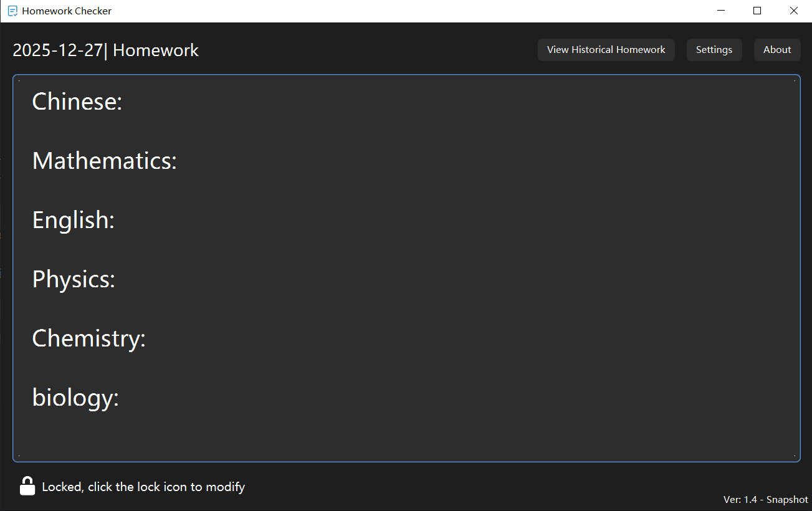
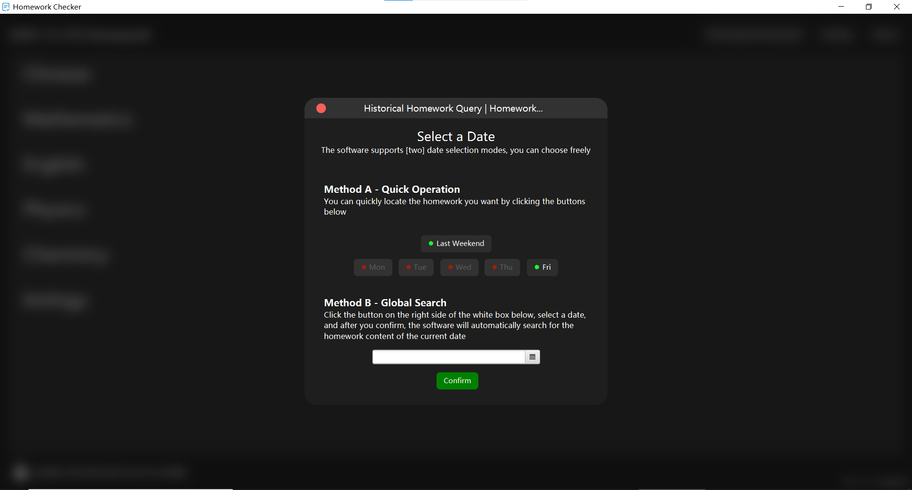
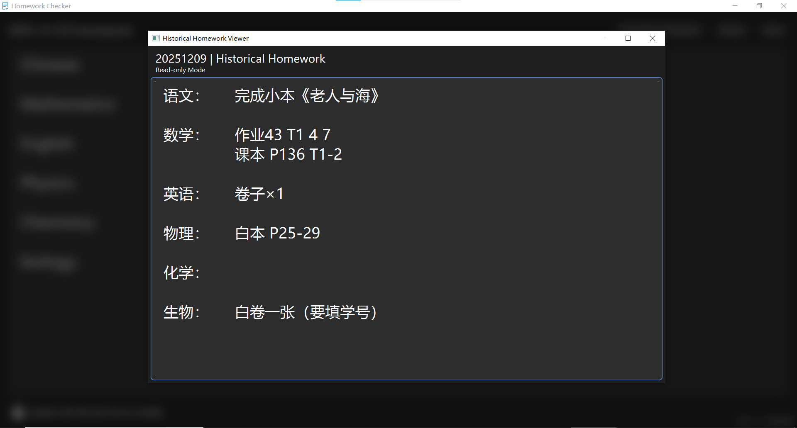
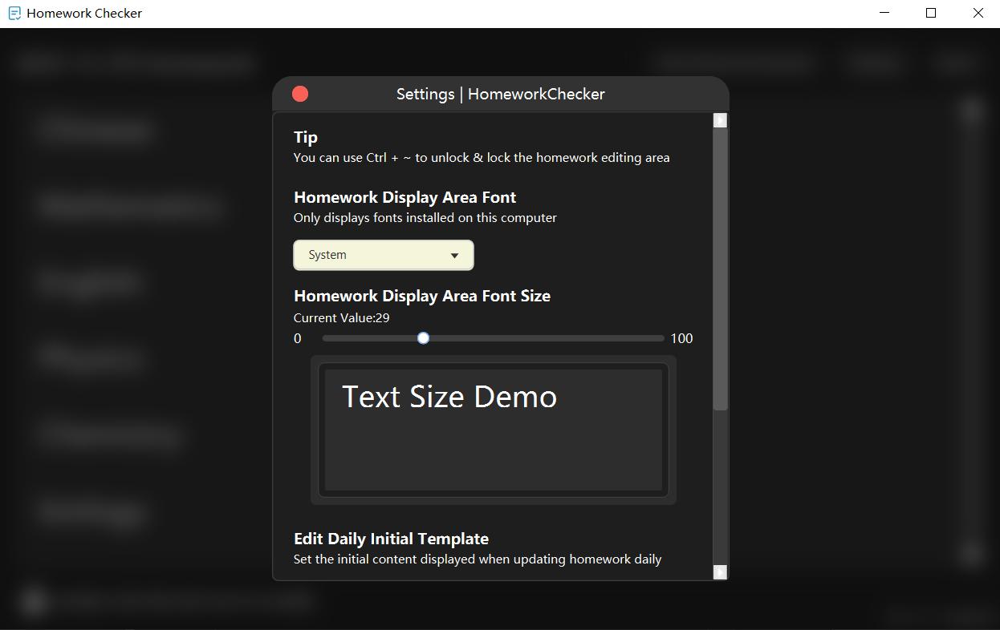
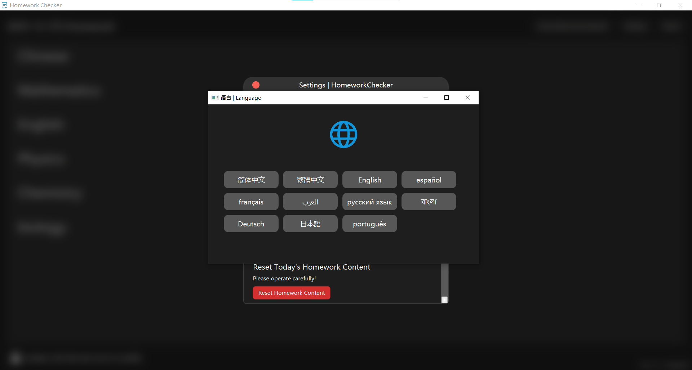
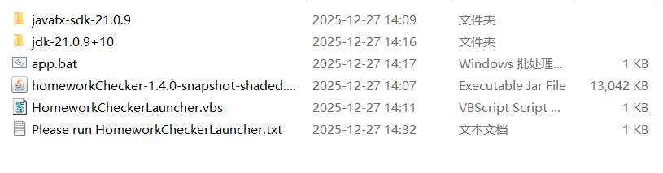

# HomeworkChecker
适用于在 **教室大屏展示作业** 的一款 **轻量级** 作业检查工具




## HomeworkChecker 有哪些 ✨亮点

### 1. 隐式保存 - 彻底解决作业保存问题
只要作业内容被修改，软件就会 **自动保存** 好修改的作业内容，避免作业内容丢失。

### 2. 历史作业查询 - 轻松获取历史作业

HomeworkChecker 自带作业数据库，可以轻松实现历史作业查询。





### 3.设置界面 - 个性化你的 HomeworkChecker

你可以随时自拟定软件，让 HomeworkChecker 真正与您并驾齐驱！



### 4. 多语言支持

截止 v1.4-snapshot 版本，HomeworkChecker已经支持 **11种** 语言，供您随意挑选



 * 当然，如果翻译有问题，您可以随时发起 issue ，我会尽力解决问题！

## 快速开始

如果您打算开始使用 HomeworkChecker，请按照以下步骤开始操作：

### 1.下载发行版

#### 注意
HomeworkChecker **不提供** 32位操作系统使用的程序  
当然，现在的32位电脑已经非常稀少了，所以这点各位大可不必担心😄

 - 访问 [发行版发布页面](https://github.com/XFTY/HomeworkChecker/releases)
 - 根据您的电脑操作系统和体系架构下载文件
   - 比如，您正在使用 Windows 操作系统，则下载带有[Win_x64]的 **.zip** 文件

### 2. 解压文件
解压文件后，你将看到以下文件


### 3. 运行 HomeworkChecker
今后，如果您需要运行 HomeworkChecker，  
双击 ```HomeworkCheckerLauncher.vbs```即可！

## 支持

如果您在软件运行时遇到问题，您可以向我发送 [issue](https://github.com/XFTY/HomeworkChecker/issues)

---
版权所有，XFTY，保留所有权利。
软件基于 GNU-GPLv3 协议开放源代码。