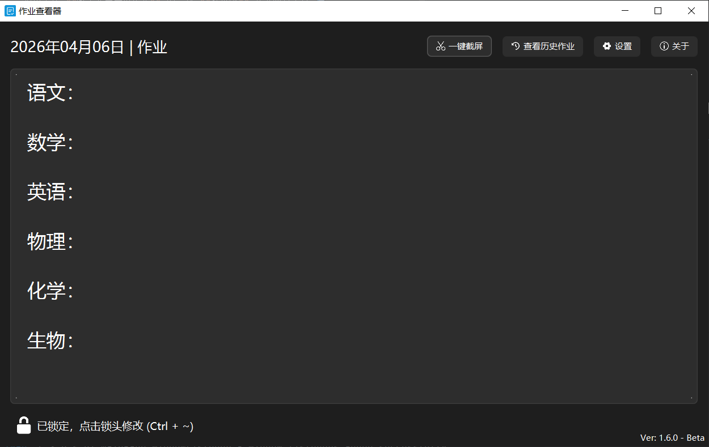
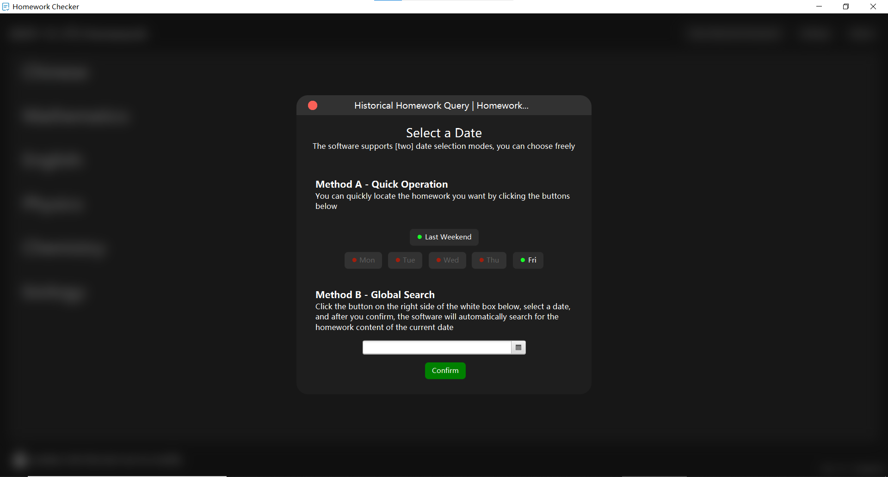
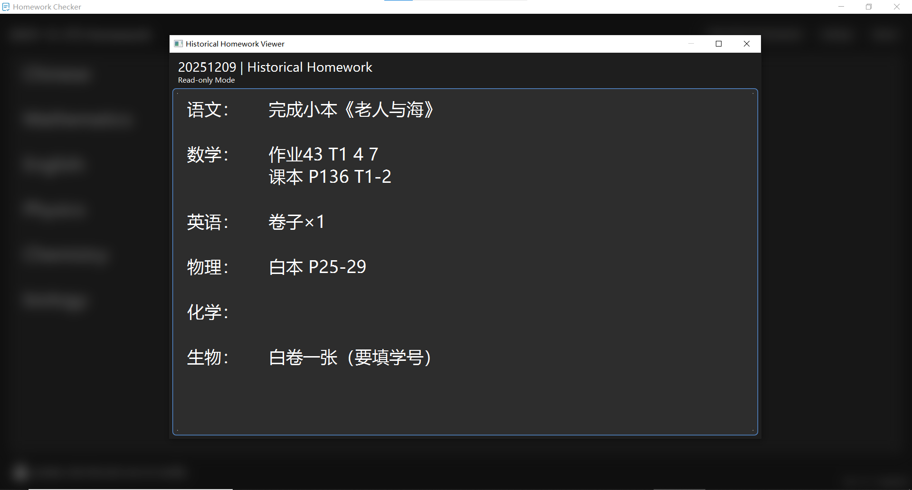
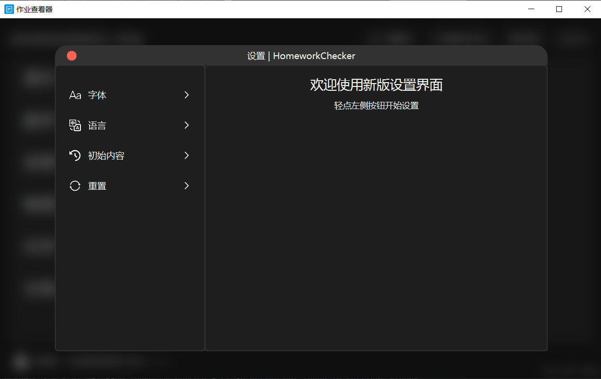
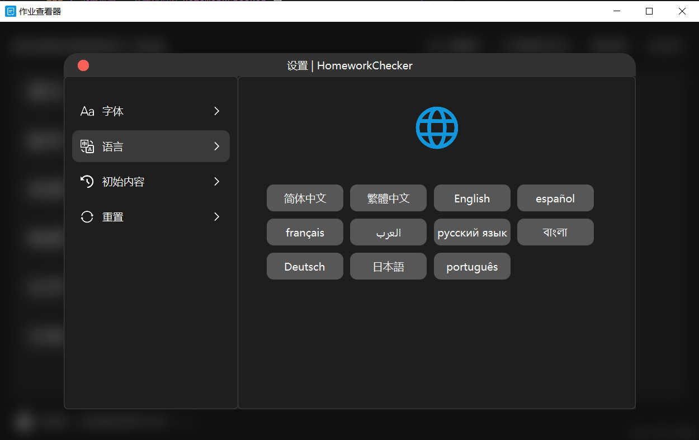
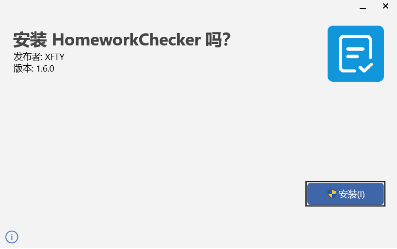
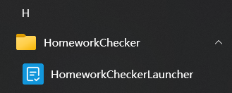
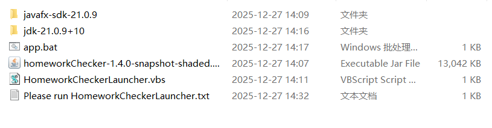

# HomeworkChecker
A homework viewing tool designed for **display on classroom screens** 📚




## What are the ✨ highlights 🌟 of HomeworkChecker?

### 1. Implicit Saving - Permanently Solve Homework Saving Issues 💾
Whenever the homework content is modified, the software will **automatically save** the changes, preventing any loss of homework content.

### 2. Historical Homework Query - Easily Access Past Homework 📅
HomeworkChecker comes with a built-in homework database, making it easy to query historical homework records.





### 3. Settings Interface - Personalize Your HomeworkChecker ⚙️
You can customize the software at any time, making HomeworkChecker truly work the way you want!  
*Starting from version 1.5, the settings interface has undergone significant changes.



### 4. Multi-language Support 🌍
As of version v1.4-snapshot, HomeworkChecker supports **11 languages** for you to choose from.



* Of course, if there are any translation issues, you can always open an issue, and I will do my best to resolve it!

## Quick Start 🚀
If you want to start using HomeworkChecker, follow the steps below:

### 1. Download the Release 📦
#### Note ⚠️
HomeworkChecker **does not provide** a version for 32-bit operating systems.  
Of course, 32-bit computers are very rare nowadays, so you probably don't need to worry about this 😄

1. Visit the [Releases Page](https://github.com/XFTY/HomeworkChecker/releases)
2. Download the (.exe) installer or (.zip) file

### If you choose to download the .exe file 📦
#### Double-click to open the .exe file
You will see the following screen:


Click "Install" to proceed.

#### Run HomeworkChecker ▶️
You can find HomeworkChecker in the Windows **Start Menu**:
  
Run **HomeworkCheckerLauncher** to start!

### If you choose to download the .zip file 📂
#### Extract the file
After extracting, you will see the following files:


#### Run HomeworkChecker ▶️
In the future, whenever you need to run HomeworkChecker,  
just double-click ```HomeworkCheckerLauncher.vbs```!

## Support 🤝
If you encounter any issues while using the software, you can send me an [issue](https://github.com/XFTY/HomeworkChecker/issues).

---

Copyright © XFTY, All Rights Reserved. ©️  
The software is open-sourced under the GNU-GPLv3 license. 🔓